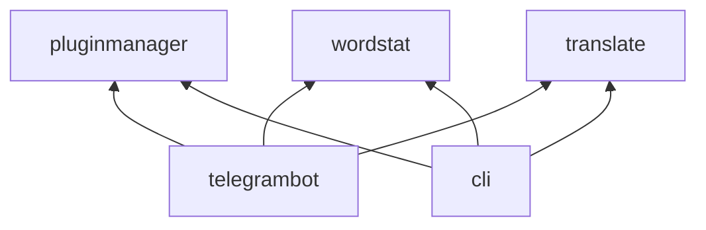

## Структура проекта

Проект разбит на модули, каждый из которых содержит изолированную логику. 
На диаграмме ниже можно увидеть зависимость между модулями



## Модули проекта

### Бот для телеграма (telegrambot)

Модуль является точкой входа для телеграмного бота и реализует всю логику специфичную для телеграма логику. 

Для адаптирования логики из `wordstat` или `translate` под телеграм в модуле реализованы для них плагины.

Для сборки проекта как бота нужно выполнить команду:

```bash
./gradlew assemblyBot
```

### Интерфейс командной строки (cli)

Модуль является точкой входа для приложения с интерфейсом командной строки, так же в нем реализован собственно сам интерфейс командной строки.

Для адаптирования логики из других модулей (таких как `wordstat` или `translate`) в модуле реализованы для них плагины с учетом особенностей `cli` интерфейса.

Для сборки проекта с интерфейсом командной строки нужно выполнить команду:

```bash
./gradlew assemblyCli
```

CLI интерфейс нужно, в основном, для ручного тестирования логики.

### Менеджер плагинов (pluginmanager)

Модуль содержит логику для управления плагинами: подключение новых, отключение старых, упорядочивание и отправление им событий.

**Важно: сами плагины реализуются не в модулях с логикой, а в специфичных точках входа**

### Модуль перевода (translate)

Модуль перевода предоставляет сервис для перевода строки на другой язык.

### Модуль статистики (wordstat)

Модуль статистики собирает статистику по переданным словам, агрегирует ее и возвращает по запросу удобочитаемом виде (например, в графиках)