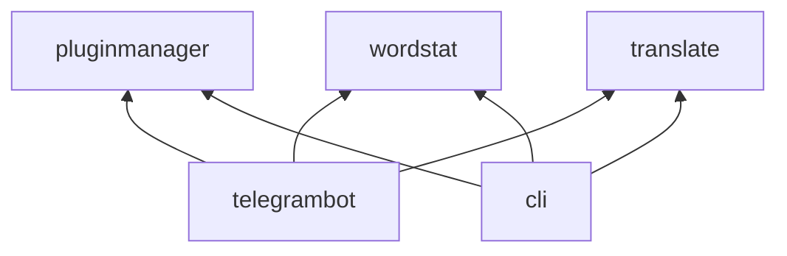

# Majordomo

A modular application that provides various services through both a Telegram bot interface and a command-line interface (CLI).

## Overview

The project is divided into independent modules, each containing isolated logic. The application can be built either as a Telegram bot or as a CLI application, making it versatile for different use cases.

## Requirements

- Java 21 or higher
- Gradle (wrapper included)
- UTF-8 system encoding

## Project Structure

The dependency between modules is shown in the diagram below:



## Installation

1. Clone the repository
2. Make sure you have Java 21 installed
3. Build the project:
   - For Telegram bot: `./gradlew assemblyBot`
   - For CLI interface: `./gradlew assemblyCli`
4. The built artifacts will be available in the `bin` directory

## Modules

### Telegram Bot (telegrambot)

The entry point for the Telegram bot functionality. This module implements all Telegram-specific logic and adapts the functionality from other modules (like `wordstat` or `translate`) through plugins.

To build the project as a Telegram bot:
```bash
./gradlew assemblyBot
```

### Command Line Interface (cli)

The entry point for the CLI application. This module implements a command-line interface and adapts functionality from other modules through CLI-specific plugins.

To build the project with CLI interface:
```bash
./gradlew assemblyCli
```

The CLI interface is primarily used for manual testing of the logic.

### Plugin Manager (pluginmanager)

Handles plugin management functionality:
- Connecting new plugins
- Disconnecting old plugins
- Plugin orchestration
- Event dispatching to plugins

Available plugins:
#### TimeZonePlugin
Displays current time for various locations around the world.

Usage:
```
/time
```

Supported locations:
- Ekaterinburg (Asia/Yekaterinburg)
- Almaty (Asia/Almaty)
- Wellington, New Zealand (Pacific/Auckland)
- Moscow (Europe/Moscow)
- Orenburg (Asia/Yekaterinburg)
- Warsaw, Poland (Europe/Warsaw)
- Tokyo, Japan (Asia/Tokyo)
- Switzerland (Europe/Zurich)

The plugin returns time in 24-hour format with timezone identifier: `HH:mm (z)`.

**Important: Plugins are implemented in specific entry points rather than in the logic modules themselves**

### Translation Module (translate)

Provides a service for translating text to different languages.

### Statistics Module (wordstat)

Collects and processes word statistics:
- Gathers statistics for provided words
- Aggregates collected data
- Returns data in a readable format (e.g., graphs)

## Additional Modules

The project includes several other modules that extend its functionality:
- convertercurrency: Currency conversion functionality
- database: Database operations and management
- vertxtgbot: Vert.x-based Telegram bot implementation

## Development

### Building
The project uses Gradle for building and dependency management. Common tasks:
```bash
./gradlew build        # Build the project
./gradlew test        # Run tests
./gradlew assemblyCli  # Build CLI version
./gradlew assemblyBot  # Build Telegram bot version
```

### Dependencies
- SLF4J 1.7.25 and Log4j 2.11.2 for logging
- JUnit 5.5.2 for testing
- Lombok 1.18.32 for reducing boilerplate code

## Contributing

1. Fork the repository
2. Create a feature branch
3. Commit your changes
4. Push to the branch
5. Create a Pull Request

## License

This project is licensed under the MIT License - see the [LICENSE](LICENSE) file for details.
